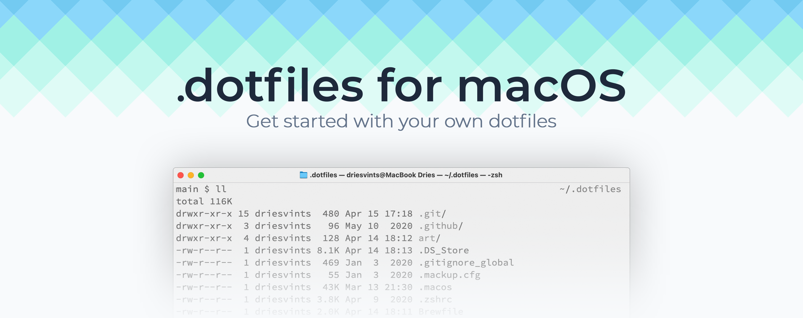

<p align="center"></p>

## Introduction

Personal dotfiles for setting up and maintaining my Mac. Based on the [driesvints/dotfiles](https://github.com/driesvints/dotfiles) template, trimmed and adapted to my workflow (research, ML, embedded).

## A Fresh macOS Setup

### Before you leave the old Mac

- Push every branch you care about.
- Save anything that isn't in iCloud / Dropbox / OneDrive.
- Export local databases.
- Verify your Obsidian vault and cloud accounts are synced.
- Transfer the files that are sensitive *and* not easily regeneratable. The Charité MDM profile blocks AirDrop, so use an iCloud Drive bundle (or a USB stick as fallback). Copy these into `~/Library/Mobile Documents/com~apple~CloudDocs/migration-bundle/`:
  - `~/.api_keys`
  - `~/.ssh/id_ed25519` (and the matching `.pub`)
  - `~/.claude/settings.json` — Claude Code user settings (sandbox config, theme, enabled plugins)
  - The `memory/` subdir from each `~/.claude/projects/<slug>/` — accumulated context Claude has about your preferences and projects
  - `~/Library/Application Support/Claude/claude_desktop_config.json` — Claude Desktop's MCP server config (Zotero, etc.)

  Verify the bundle has finished uploading on the old Mac (no cloud-arrow icons in Finder), then delete the directory after the new Mac is set up.
- Regenerate the rest on the new Mac in a few minutes — no backup needed:
  - `~/.ssh/config` — recreate by hand (it's just a host list)
  - `~/.config/rclone/rclone.conf` — `rclone config` (re-auth each remote)
  - `~/.docker/config.json` — `docker login` against the registries you use
  - `~/.kaggle/kaggle.json` — re-download from kaggle.com → Account → Create New Token
  - Tunnelblick `.tblk` profiles — re-import via Tunnelblick.app
  - Claude Code plugins — `/plugin install github@claude-plugins-official` (or auto-installs on first launch)
- For apps with native cloud sync, just sign in on the new Mac — no manual export needed: VS Code (Settings Sync), Cursor, Claude, ChatGPT, Slack, Discord, Telegram, Signal, Spotify, NordVPN, Obsidian.
- Hammerspoon and Karabiner configs are versioned in this repo under [`configs/`](./configs) — keep them current.

### Setting up the new Mac

1. Update macOS to the latest version.
2. Get an SSH key set up — do this BEFORE step 3 (cloning) because the clone uses SSH. Two options:

   **A. Reuse the existing key.** Pull `id_ed25519` and `id_ed25519.pub` from the iCloud-Drive `migration-bundle/` into `~/.ssh/`:
    ```zsh
    mkdir -p ~/.ssh && chmod 700 ~/.ssh
    cp ~/Library/Mobile\ Documents/com~apple~CloudDocs/migration-bundle/id_ed25519* ~/.ssh/
    chmod 600 ~/.ssh/id_ed25519
    ssh-add --apple-use-keychain ~/.ssh/id_ed25519
    ssh -T git@github.com   # accept the host fingerprint
    ```
   `ssh-add --apple-use-keychain` stores the passphrase in the macOS Keychain so SSH later calls (clone, fresh.sh's `brew install` from git sources, project clones) run silently.

   **B. Generate a fresh key.** Skip the iCloud-bundle copy entirely. Run:
    ```zsh
    curl https://raw.githubusercontent.com/JohannKaspar/dotfiles/HEAD/ssh.sh | sh -s "<your-email>"
    ```
   Then paste the new public key at <https://github.com/settings/keys>. After it's added, `ssh -T git@github.com` should succeed. Delete the old key from GitHub once the new Mac is verified working.
3. Clone this repo:
    ```zsh
    git clone --recursive git@github.com:JohannKaspar/dotfiles.git ~/.dotfiles
    ```
4. Run the installer:
    ```zsh
    cd ~/.dotfiles && ./fresh.sh
    ```
   This installs Oh My Zsh, Homebrew, everything in [`Brewfile`](./Brewfile), symlinks `.zshrc`, configures git, creates `~/Projects/`, symlinks the Hammerspoon + Karabiner configs from [`configs/`](./configs), and applies macOS defaults from [`.macos`](./.macos).
5. Move the rest of the files from the iCloud-Drive `migration-bundle/` into place:
   - `.api_keys` → `$HOME/.api_keys`
   - `settings.json` → `~/.claude/settings.json` (create the dir if missing)
   - The `memory/` subdirs → matching `~/.claude/projects/<project-slug>/memory/`
   - `claude_desktop_config.json` → `~/Library/Application Support/Claude/`

   Then regenerate the rest interactively as needed: `rclone config`, `docker login`, download a new `kaggle.json`, import Tunnelblick `.tblk` files.
6. Start apps that need post-install login (Claude, ChatGPT, Cursor, VS Code, Slack, Discord, Spotify, NordVPN, Ledger Wallet, Zotero, Obsidian). Settings sync down automatically where supported.
7. Reboot.

## What's in here

- [`Brewfile`](./Brewfile) — formulae, casks, MAS apps, VS Code extensions.
- [`.zshrc`](./.zshrc) — Oh My Zsh setup with the `minimal` theme; sources `~/.api_keys`.
- [`aliases.zsh`](./aliases.zsh) — git/k8s shortcuts and the `workon`/`activate` helpers for `~/Projects/<name>/.venv`.
- [`path.zsh`](./path.zsh) — `$PATH` additions (loaded via `ZSH_CUSTOM`).
- [`.macos`](./.macos) — macOS defaults (Finder, Dock, screenshots, etc.).
- [`gitconfig.sh`](./gitconfig.sh) — global git identity + excludes file.
- [`ssh.sh`](./ssh.sh) — bootstrap a fresh ed25519 SSH key.
- [`fresh.sh`](./fresh.sh) — orchestrates the full install.
- [`clone.sh`](./clone.sh) — clones the repos you want into `~/Projects/`. Edit before running on a new Mac.
- [`configs/hammerspoon/init.lua`](./configs/hammerspoon/init.lua) — Hammerspoon config, symlinked to `~/.hammerspoon/init.lua`.
- [`configs/karabiner/karabiner.json`](./configs/karabiner/karabiner.json) — Karabiner-Elements config, symlinked to `~/.config/karabiner/karabiner.json`.
- [`scripts/`](./scripts) — SSH tunnels for remote Jupyter/TensorBoard and an rsync download helper.

This repo previously used [Mackup](https://github.com/lra/mackup) to sync app preferences via iCloud. Mackup has been effectively unmaintained since 2023 and was retired from this setup. App preferences are now handled via each app's native sync (VS Code Settings Sync, Cursor, Karabiner-Elements GitHub sync, etc.) or just regenerated on a new Mac.

## Maintenance

- Keep the Brewfile current: `brew bundle dump --force --file=Brewfile` (review the diff before committing — `dump` may add things you don't want).
- Periodically: `brew bundle cleanup --file=Brewfile --dry-run` to spot drift.
- The Hammerspoon / Karabiner files in `configs/` are symlinked into place by `fresh.sh`, so editing them in either location updates the repo. After tweaking, just `git commit`.

## Credits

Forked from [driesvints/dotfiles](https://github.com/driesvints/dotfiles). Theme by [@subnixr](https://github.com/subnixr).
